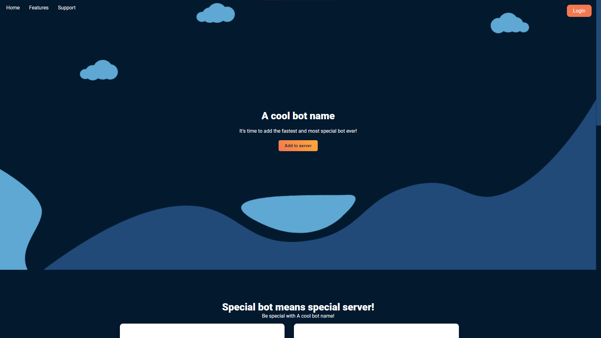

# DisDash

A modern, stripped discord bot dashboard, designed with minimal coding requirements in mind!

# Setup

You can setup the website in two easy steps, **Note: This is a basic setup and if you want to use it properly, take the time to look through all the code, and understand what is going on so you can change it in future**

1. Run BundleCode.sh
2. In assets/js/replacement.js change botName to whatever the name of your bot is. Then commit your changes and boom! All done!

## Contacts
jamesinaxx - Discord: jamesina#1111

See ``LICENSE`` for more info on the legal stuff
